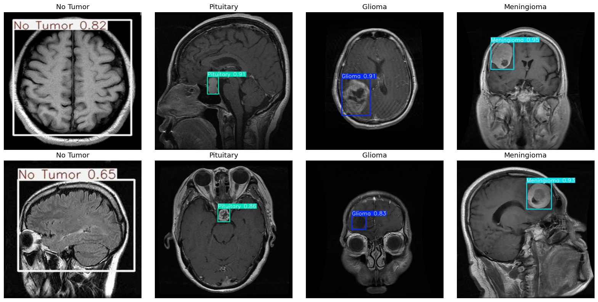

# Brain Tumor Detection Using Deep Learning

This repository implements a deep learning-based system for detecting and classifying brain tumors using MRI images. The system leverages YOLOv5 for tumor localization and Vision Transformer (ViT) along with GoogleNet for accurate classification.

## Table of Contents
- [Introduction](#introduction)
- [Features](#features)
- [Repository Structure](#repository-structure)
- [Requirements](#requirements)
- [Installation](#installation)
- [Usage](#usage)
- [Sample Output](#sample-output)
- [Dataset](#dataset)
- [Future Enhancements](#future-enhancements)
- [Acknowledgements](#acknowledgements)
- [License](#license)

---

## Introduction

Brain tumor diagnosis is a critical medical challenge, often requiring time-intensive manual analysis. This project automates the process, combining object detection (YOLOv5) with classification models (ViT and GoogleNet) to achieve real-time, accurate results. The system supports the detection of Glioma, Meningioma, Pituitary tumors, and normal cases from MRI scans.

---

## Features

- **Object Detection**: YOLOv5 localizes tumors within MRI scans using bounding boxes.
- **Tumor Classification**: Vision Transformer and GoogleNet classify localized tumors into distinct categories.
- **End-to-End Workflow**: Includes data preprocessing, model training, evaluation, and result visualization.
- **Visualization**: Displays bounding boxes and classifications on MRI images.

---

## Repository Structure

```
brain-tumor-detection/
├── data/                  # Dataset folder (contains MRI images)
├── BrainTumorYOLO&GoogleNet.ipynb  # Main notebook
├── requirements.txt       # Dependencies
├── output_sample.png      # Example of system output
└── README.md              # Project documentation
```

---

## Requirements

Ensure you have Python 3.8+ installed. Install the dependencies using:

```bash
pip install -r requirements.txt
```

---

## Installation

1. Clone the repository:
   ```bash
   git clone https://github.com/<your-username>/brain-tumor-detection.git
   ```
2. Navigate to the project directory:
   ```bash
   cd brain-tumor-detection
   ```

---

## Usage

1. **Dataset**: Place your dataset images in the `data/` folder.
2. **Notebook**: Run the Jupyter Notebook to preprocess data, train models, and evaluate results.
   ```bash
   jupyter notebook BrainTumorYOLO&GoogleNet.ipynb
   ```
3. **Visualize Output**: Check the `output_sample.png` for an example of the model's performance.

---

## Sample Output

Here is an example of how the system's output looks:



The image shows:
- Bounding boxes around detected tumors.
- Classification labels for each tumor.

---

## Dataset

The dataset consists of MRI images categorized as:
- **Glioma**
- **Meningioma**
- **Pituitary Tumors**
- **No Tumor**

---

## Future Enhancements

- **Multimodal Data**: Integrate additional MRI modalities (T1, T2, FLAIR) for enhanced generalization.
- **Advanced Models**: Experiment with attention mechanisms and transformers for better feature extraction.
- **Clinical Validation**: Test the system in real-world medical settings to ensure reliability.

---

## Acknowledgements

- [YOLOv5](https://github.com/ultralytics/yolov5)
- [Vision Transformer (ViT)](https://arxiv.org/abs/2010.11929)
- [Google Research](https://github.com/google-research/vision_transformer?utm_source=catalyzex.com)
- [GoogleNet](https://arxiv.org/abs/1409.4842)
- [Kaggle Dataset]([https://www.kaggle.com/](https://www.kaggle.com/datasets/ahmedsorour1/mri-for-brain-tumor-with-bounding-boxes))

---

## License

This project is licensed under the MIT License. See the `LICENSE` file for details.
